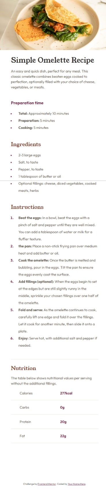
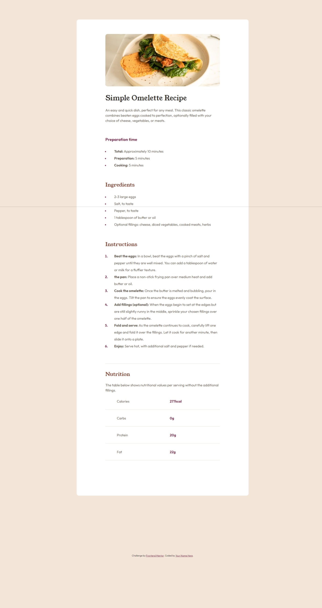

# Frontend Mentor - Recipe page solution

This is a solution to the [Recipe page challenge on Frontend Mentor](https://www.frontendmentor.io/challenges/recipe-page-KiTsR8QQKm). Frontend Mentor challenges help you improve your coding skills by building realistic projects. 

## Table of contents

- [Overview](#overview)
  - [The challenge](#the-challenge)
  - [Screenshot](#screenshot)
  - [Links](#links)
- [My process](#my-process)
  - [Built with](#built-with)
  - [What I learned](#what-i-learned)
  - [Continued development](#continued-development)
- [Author](#author)
- [Acknowledgments](#acknowledgments)

**Note: Delete this note and update the table of contents based on what sections you keep.**

## Overview

### Screenshot




### Links

- Solution URL: [https://www.frontendmentor.io/solutions/responsive-layout-mobile-first-css-variables-html5-css3-8aw8HzHRgP]
- [https://wscott94.github.io/Recipe-page-main/]

## My process

### Built with

- Semantic HTML5 markup
- CSS custom properties
- Mobile-first workflow

### What I learned

This helped me get a better grasp on coding as a whole. its been a year since i coded anything and using this as a refresher and intro assignment really helped reawaken the knowledge.

To see how you can add code snippets, see below:

```html
<h1>Some HTML code I'm proud of</h1>
```
```css
.proud-of-this-css {
  color: papayawhip;
}
```
```js
const proudOfThisFunc = () => {
  console.log('🎉')
}
```

If you want more help with writing markdown, we'd recommend checking out [The Markdown Guide](https://www.markdownguide.org/) to learn more.

All of it coding is a part of a fun and confusing art form, im thrilled to master but still struggling to understand and connect all the dots.

## Author

- Website - [Will Scott](https://www.your-site.com)
- Frontend Mentor - [@wscott94](https://www.frontendmentor.io/profile/wscott94)

## Acknowledgments

Shoutout to my class for askng good question and my teacher for being understanding and helpful explaning these new tools. 

